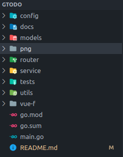

# GTODO
**一个使用GO(gin+gorm)+VUE+VITE+MYSQL的前后端分离的简单的备忘录项目**
****
## 功能简述
1. 登陆注册功能
2. 备忘录待办事项及状态改变显示
3. 个人信息展示及功能修改
4. 添加待办事项，指派待办事项
5. 对完成情况的简单统计

## 项目结构
   
| **文件夹**    | **功能**                                                       |
| ------------- | -------------------------------------------------------------- |
| ```config```  | 数据库的相关配置文件，可进行修改                               |
| ```docs```    | swagger插件自动生成的接口解释及配置文档                        |
| ```models```  | 项目中用户和消息的类型，并给出相应的CRUD逻辑实现               |
| ```png```     | 运行时截图以及说明文档中的图片                                 |
| ```router```  | 路由注册以及应用的路由                                         |
| ```service``` | 具体的接口实现                                                 |
| ```tests```   | 利用gorm进行数据库相关表的建立                                 |
| ```utils```   | 解决跨域访问，数据库初始化，密码加密以及雪花算法生成ID的工具类 |
| ```vue-f```   | 前端代码，使用VUE+element-plus+windcss完成                     |
| ```main.go``` | 程序入口代码                                                   |

## 运行
1. 安装go语言环境，并配置好环境变量
2. 安装mysql数据库
3. 安装nodejs环境，并配置好环境变量
4. 将项目clone到本地
5. 修改数据库配置文件```config/app.yaml```
6. cd到```vue-f```文件夹下，执行```npm install```安装依赖
7. 执行```npm run dev```启动前端项目
8. 进入项目根目录，执行```go run .```启动后端项目
9. 访问```localhost:5173```即可看到页面